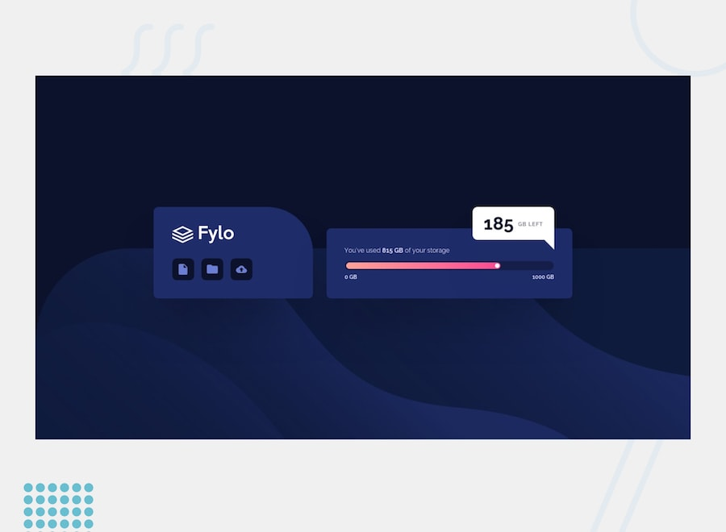

# Frontend Mentor - Fylo data storage component solution

## Welcome! 👋

Thanks for checking out my solution of Fylo data storage component Form front-end coding challenge from Frontend Mentor. 
[Frontend Mentor](https://www.frontendmentor.io) challenges improve coding skills by building realistic projects.

## Table of contents

- [Overview](#overview)
  - [The challenge](#the-challenge)
  - [Links](#links)
- [My process](#my-process)
  - [Built with](#built-with)
  - [Useful resources](#useful-resources)
- [Author](#author)
- [Acknowledgments](#acknowledgments)

## Overview

### The challenge

Users should be able to:

- View the optimal layout for the site depending on their device's screen size

I do not have access to the Figma sketch so the design is not pixel perfect.

### Links

- Solution URL: [Solution URL](https://www.frontendmentor.io/solutions/fylo-data-storage-component-solution-WYB7tTvqq6)
- Live Site URL: [Live site URL](https://ilham-bouk.github.io/Fylo_data_storage_component/)

## My process

### Built with
 
- Semantic HTML5 markup
- CSS custom properties
- Grid
- Flexbox
- Desktop-first workflow

You will find all the required assets in the `/design` folder. The assets are already optimized. 
There is also a `style-guide.md` file containing the information you'll need, such as color palette and fonts.

## Author

- Frontend Mentor - [@ilham-bouk](https://www.frontendmentor.io/profile/ilham-bouk)
- LinkedIn - [Ilham Bouktir](https://www.linkedin.com/in/ilham-bouktir-0b266b31b)

## Acknowledgments

A big thank you to anyone providing feedback on [my solution](https://www.frontendmentor.io/solutions/fylo-data-storage-component-solution-WYB7tTvqq6). It definitely helps to find new ways to code and find easier solutions!

**Happy coding!** ☺️🚀
